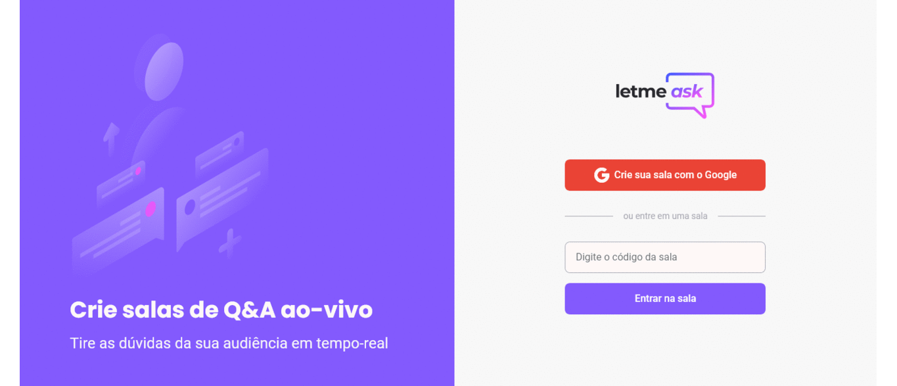
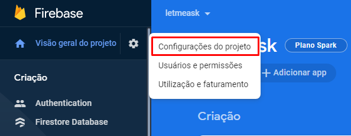
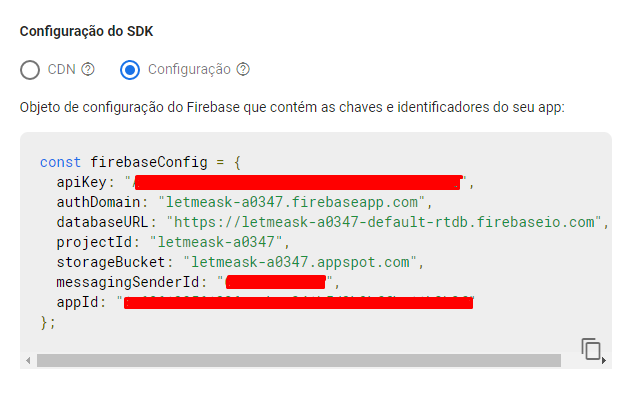
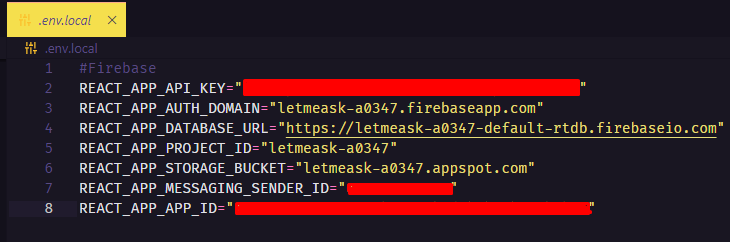
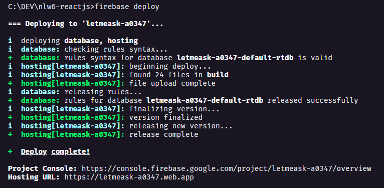

<p align="center">
  
</p>

<p align="center">

  

  <a href="https://www.linkedin.com/in/elves/">
    
  </a>

  

   


  
	
  <a href="https://github.com/elvesw/nlw6-reactjs/commits/master">
    
  </a>

  

  

</p>

<h1 align="center">
    
</h1>

<br>

## ✅ Features
- [x] Autenticação com conta Google
- [x] Página com sala exclusiva para perguntas da sua audiência
- [x] Página de perfil com todas salas criadas pelo usuário
- [x] Página com todas as salas, abertas para perguntar e fechadas para rever as perguntas
- [ ] Layout responsivo
- [ ] Tema Dark e Light


## ✔️ Demonstração da aplicação
Hospedado Firebase Hosting, veja como ficou, deixe seu _Oieee_ registrado.
- [https://letmeask-a0347.web.app](https://letmeask-a0347.web.app/rooms/-MdFlb6GTIK7Mct1l1wI)

## 🧪 Tecnologias

Esse projeto foi desenvolvido com as seguintes tecnologias:

- [](https://reactjs.org)
- [](https://firebase.google.com/)
- [](https://www.typescriptlang.org/)
## 🚀 Como executar

Clone o projeto e acesse a pasta do mesmo.

```bash
$ git clone https://github.com/elvesw/nlw6-reactjs
$ cd nlw6-reactjs
```

Para iniciá-lo, siga os passos abaixo:
```bash
# Instalar as dependências
$ yarn

# Cria um arquivo .env.local
$ copy .env.example .env.local
```

Lembrando que será necessário criar uma conta no [Firebase](https://firebase.google.com/) e um projeto para disponibilizar um Realtime Database.
Verificar as informações da apiKey do seu projeto firebase e demais informações, conforme imagens abaixo.





E em seguida colocar as informações no arquivo .env.local



Para iniciá-lo, siga os passos abaixo:
```bash
# o projeto está pronto para iniciar
$ yarn start
```
O app estará disponível no seu browser pelo endereço http://localhost:3000

## 🔥 Deploy no Firebase
```bash
# Instala o firebase-tools global
$ npm install -g firebase-tools 

# Abre uma página da Web que se conecta ao código localhost
$ firebase login

# Inicializa um projeto do Firebase
$ firebase init

# Build do projeto
$ yarn build

# Deploy do projeto no Firebase
$ firebase deploy
```

## 💻 Projeto

Letmeask é perfeito para criadores de conteúdos poderem criar salas de Q&A com o seu público, de uma forma muito organizada e democrática. 

Exemplo: uma live com 5000 pessoas online, fica difícil responder a todos, mais é possível responder as mais votadas pela galera.

Este é um projeto desenvolvido durante a **[Next Level Week Together](https://nextlevelweek.com/)**, apresentada dos dias 20 a 27 de Junho de 2021.


## 🔖 Layout

Você pode visualizar o layout do projeto através do link abaixo:

- [Layout Web](https://www.figma.com/file/u0BQK8rCf2KgzcukdRRCWh/Letmeask/duplicate) 

Lembrando que você precisa ter uma conta no [Figma](http://figma.com/).

## 📝 License

Esse projeto está sob a licença MIT. Veja o arquivo [LICENSE](LICENSE.md) para mais detalhes.

---

Valeu - NLW06 Together👋🏻 [Participe da comunidade da Rocketseat!](https://discord.gg/gKUVrzrPrU)
